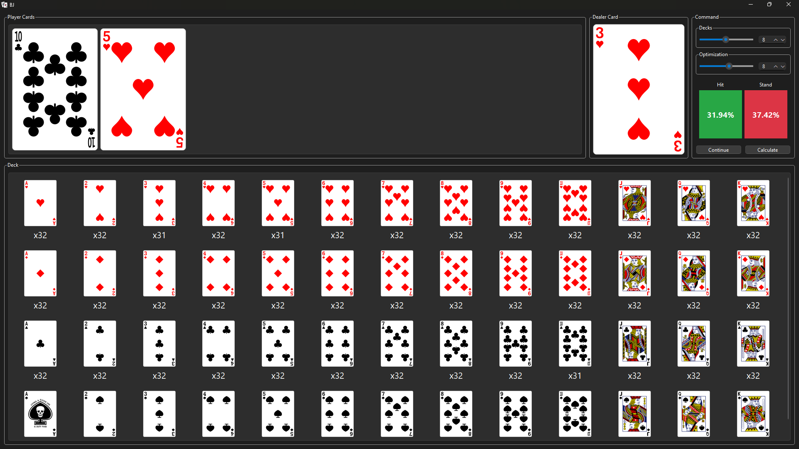

# Probabilità Condizionata e Algoritmo Ricorsivo per Decisioni Ottimali

💡 Analisi delle scelte probabilistiche in scenari decisionali incerti

Questo progetto implementa un algoritmo ricorsivo basato sulle probabilità condizionate per valutare la scelta ottimale tra due azioni possibili. L'obiettivo è determinare la probabilità di successo scegliendo tra pescare o stare, utilizzando un modello basato sulla teoria delle probabilità e un approccio iterativo per l'aggiornamento delle decisioni.

## 📊 Algoritmo di Calcolo delle Probabilità

Per determinare la probabilità di vincere pescando e la probabilità di vincere stando, il sistema si basa su un modello probabilistico ricorsivo.

### 1️⃣ Probabilità di vincere pescando

Per calcolare la probabilità di successo pescando, dobbiamo considerare ogni possibile carta che può essere estratta. Se chiamiamo 
𝑋 l'insieme delle carte disponibili nel mazzo, la probabilità complessiva è data dalla somma ponderata delle probabilità condizionate di vittoria per ogni carta possibile:

$$
P_{hit} = \sum_{x \in X} P(x) \cdot P_{win | x}
$$

Dove:
\( P(x) \): è la probabilità di pescare la carta 𝑥
$$ P_{win | x} $$: è la probabilità di vincere dato che abbiamo pescato la carta 𝑥

